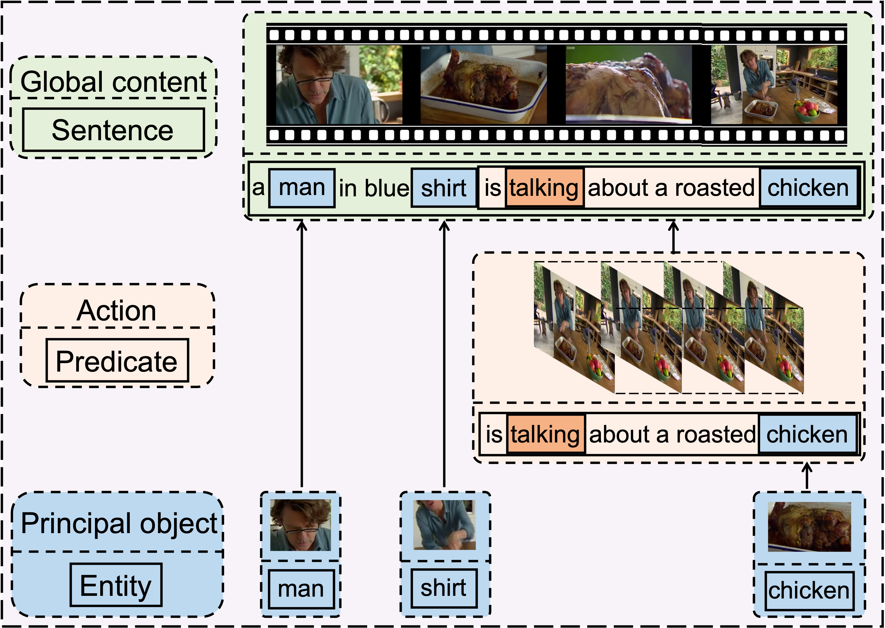
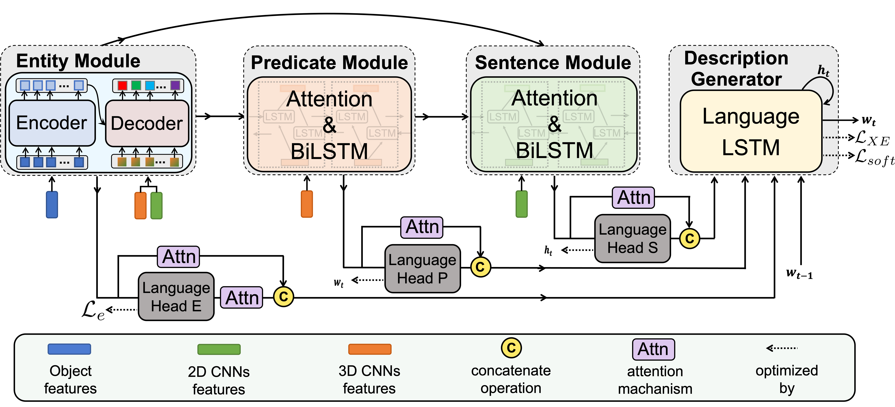
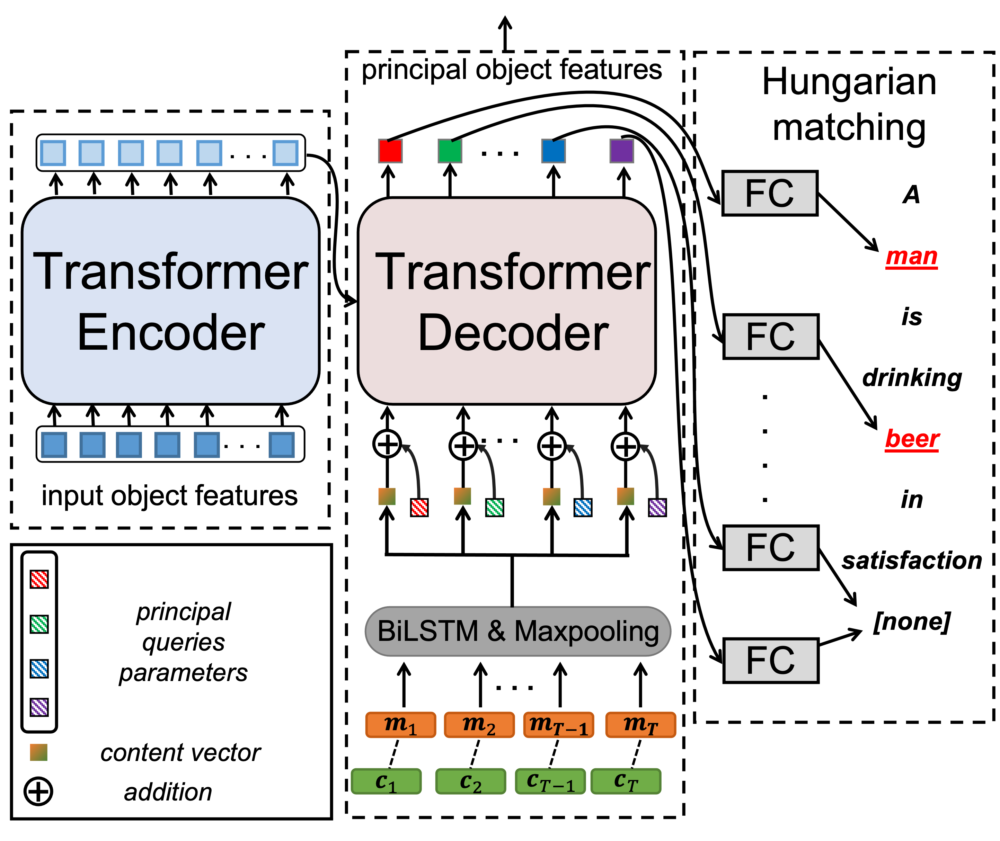
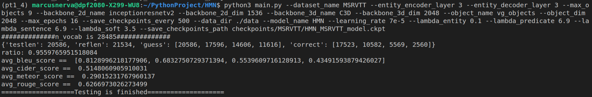
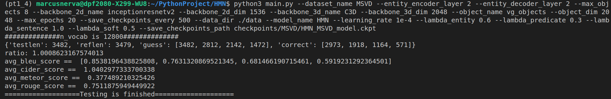

# HMN
[[Paper]](https://arxiv.org/abs/2111.12476) 

Official code for **Hierarchical Modular Network for Video Captioning**. <br>

*Hanhua Ye, Guorong Li, Yuankai Qi, Shuhui Wang, Qingming Huang, Ming-Hsuan Yang*

Accepted by CVPR2022<br>



<center><div style="color:orange; display: inline-block; color: black; padding: 2px;">Figure 1.Motivation</div></center>

Representation learning plays a crucial role in video captioning task. Hierarchical Modular Network learns a discriminative video representation by bridging video content and linguistic caption at three levels: 

1. Entity level, which highlights objects that are most likely to be mentioned in captions and is supervised by *entities* in ground-truth captions.
2. Predicate level, which learns the actions conditioned on highlighted objects and is supervised by the *predicate* in the ground-truth caption.
3. Sentence level, which learns the global video representation supervised by the whole ground-truth *sentence*.

As there are a large number of objects in a video, but only a few are mentioned in captions, we proposed a novel entity module to learn to highlight these principal objects adaptively. Experimental results demonstrate that highlighting principal video objects will improve the performance significantly. 


## Methodology

As shown in Figure 2, our model follows the conventional **Encoder-Decoder** paradigm, where the proposed Hierarchical Modular Network (HMN) serves as the encoder. HMN consists of the entity, predicate, and sentence modules. These modules are designed to bridge video representations and linguistic semantics from three levels. Our model operates as follows. First, taking all detected objects as input, the entity module outputs the features of principal objects. The predicate module encodes actions by combining features of principal objects and the video motion. Next, the sentence module encodes a global representation for the entire video content considering the global context and features of previously generated objects and actions. Finally, all features are concatenated together and fed into the decoder to generate captions. Each module has its own input and linguistic supervision extracted from captions.



<center><div style="color:orange;  display: inline-block; color: black; ">Figure 2. Hierarchical Modular Network</div></center>

Figure 3 illustrates the main architecture of our entity module, which consists of a transformer encoder and transformer decoder. This design is motivated by [DETR](https://arxiv.org/abs/2005.12872), which utilizes a transformer encoder-decoder architecture to learn a fixed set of object queries to directly predict object bounding boxes for the object detection task. Instead of simply detecting objects, we aim to determine the important ones in the video.



<center><div style="color:orange;  display: inline-block; color: black; ">Figure 3. Main architecture of the entity module</div></center>


## Usage

Our proposed HMN is implemented with PyTorch.

#### Environment

- Python = 3.7
- PyTorch = 1.4


#### 1.Installation

- Clone this repo:

```
git clone https://github.com/MarcusNerva/HMN.git
cd HMN
```

+ Clone a python3-version coco_caption repo under the utilis/


#### 2.Download datasets

**MSR-VTT Dataset:**

- Context features (2D CNN features) : [MSRVTT-InceptionResNetV2](https://1drv.ms/u/s!ArYBhHmSAbFOc20zPEg-aSP7_cI?e=fhT1lN)
- Motion features (3D CNN features) : [MSRVTT-C3D](https://1drv.ms/u/s!ArYBhHmSAbFOdKU9iZgHFGFHCAE?e=H5DyOE)
- Object features (Extracted by Faster-RCNN) : [MSRVTT-Faster-RCNN](https://1drv.ms/u/s!ArYBhHmSAbFOdVQnfilWp6_epv4?e=Am9OXT)
- Linguistic supervision: [MSRVTT-Language](https://1drv.ms/u/s!ArYBhHmSAbFOe0dX-SBDdxJ9RHM?e=ZlNbBQ)
- Splits: [MSRVTT-Splits](https://1drv.ms/u/s!ArYBhHmSAbFOgURAYMc4f2-TeI0U?e=tde70k)

**MSVD Dataset:** 

- Context features (2D CNN features) : [MSVD-InceptionResNetV2](https://1drv.ms/u/s!ArYBhHmSAbFOeMT-jksQPhkzYHA?e=mO2DTu)
- Motion features (3D CNN features) : [MSVD-C3D](https://1drv.ms/u/s!ArYBhHmSAbFOd8H6ciT2CYwqFaE?e=VeWdS8)
- Object features (Extracted by Faster-RCNN) : [MSVD-Faster-RCNN](https://1drv.ms/u/s!ArYBhHmSAbFOef5wZTxndFlz7bQ?e=fBPFHG)
- Linguistic supervision: [MSVD-Language](https://1drv.ms/u/s!ArYBhHmSAbFOetaEHJnITH8q-eE?e=ePZlcn)
- Splits: [MSVD-Splits](https://1drv.ms/u/s!ArYBhHmSAbFOgUj3RjfW982_KntY?e=hPMWYI)


#### 3.Prepare training data

- Organize visual and linguistic features under `data/`

```bash
data
├── __init__.py
├── loader
│   ├── data_loader.py
│   └── __init__.py
├── MSRVTT
│   ├── language
│   │   ├── embedding_weights.pkl
│   │   ├── idx2word.pkl
│   │   ├── vid2groundtruth.pkl
│   │   ├── vid2language.pkl
│   │   ├── word2idx.pkl
│   │   └── vid2fillmask_MSRVTT.pkl
│   ├── MSRVTT_splits
│   │   ├── MSRVTT_test_list.pkl
│   │   ├── MSRVTT_train_list.pkl 
│   │   └── MSRVTT_valid_list.pkl
│   └── visual
│       ├── MSRVTT_C3D_test.hdf5
│       ├── MSRVTT_C3D_train.hdf5
│       ├── MSRVTT_C3D_valid.hdf5
│       ├── MSRVTT_inceptionresnetv2_test.hdf5
│       ├── MSRVTT_inceptionresnetv2_train.hdf5
│       ├── MSRVTT_inceptionresnetv2_valid.hdf5
│       ├── MSRVTT_vg_objects_test.hdf5
│       ├── MSRVTT_vg_objects_train.hdf5
│       └── MSRVTT_vg_objects_valid.hdf5
└── MSVD
    ├── language
    │   ├── embedding_weights.pkl
    │   ├── idx2word.pkl
    │   ├── vid2groundtruth.pkl
    │   ├── vid2language.pkl
    │   ├── word2idx.pkl
    │   └── vid2fillmask_MSVD.pkl
    ├── MSVD_splits
    │   ├── MSVD_test_list.pkl
    │   ├── MSVD_train_list.pkl
    │   └── MSVD_valid_list.pkl
    └── visual
        ├── MSVD_C3D_test.hdf5
        ├── MSVD_C3D_train.hdf5
        ├── MSVD_C3D_valid.hdf5
        ├── MSVD_inceptionresnetv2_test.hdf5
        ├── MSVD_inceptionresnetv2_train.hdf5
        ├── MSVD_inceptionresnetv2_valid.hdf5
        ├── MSVD_vg_objects_test.hdf5
        ├── MSVD_vg_objects_train.hdf5
        └── MSVD_vg_objects_valid.hdf5
```


## Pretrained Model

[Pretrained model on MSR-VTT](https://1drv.ms/u/s!ArYBhHmSAbFOgTicz9UR4ljs_JD4?e=YC8gKW)

[Pretrained model on MSVD](https://1drv.ms/u/s!ArYBhHmSAbFOgT1ahP77Tij-6yUy?e=KeoDZV)

Download pretrained model on MSR-VTT and MSVD via above links, and place them undir checkpoints dir:

```
mkdir -p checkpoints/MSRVTT
mkdir -p checkpoints/MSVD
```

Finally got:

```
checkpoints/
├── MSRVTT
│   └── HMN_MSRVTT_model.ckpt
└── MSVD
    └── HMN_MSVD_model.ckpt
```


## Training & Testing

#### Training: MSR-VTT

```bash
python -u main.py --dataset_name MSRVTT --entity_encoder_layer 3 --entity_decoder_layer 3 --max_objects 9 \
			--backbone_2d_name inceptionresnetv2 --backbone_2d_dim 1536 \
			--backbone_3d_name C3D --backbone_3d_dim 2048 \
			--object_name vg_objects --object_dim 2048 \
			--max_epochs 16 --save_checkpoints_every 500 \
			--data_dir ./data --model_name HMN 
			--language_dir_name language \
			--learning_rate 7e-5 --lambda_entity 0.1 --lambda_predicate 6.9 --lambda_sentence 6.9 --lambda_soft 3.5 
```


#### Training: MSVD

```bash
python -u main.py --dataset_name MSVD --entity_encoder_layer 2 --entity_decoder_layer 2 --max_objects 8 \
			--backbone_2d_name inceptionresnetv2 --backbone_2d_dim 1536 \
			--backbone_3d_name C3D --backbone_3d_dim 2048 \
			--object_name vg_objects --object_dim 2048 \
			--max_epochs 20 --save_checkpoints_every 500 \
			--data_dir ./data --model_name HMN \
			--language_dir_name language --language_package_name vid2language_old \
			--learning_rate 1e-4 --lambda_entity 0.6 --lambda_predicate 0.3 --lambda_sentence 1.0 --lambda_soft 0.5 
```


#### Testing MSR-VTT & MSVD

Comment out `train_fn` in `main.py` first.

```python
model = train_fn(cfgs, cfgs.model_name, model, hungary_matcher, train_loader, valid_loader, device)
```


For MSR-VTT:

```
python3 main.py --dataset_name MSRVTT \
				--entity_encoder_layer 3 --entity_decoder_layer 3 --max_objects 9 \
				--backbone_2d_name inceptionresnetv2 --backbone_2d_dim 1536 \
				--backbone_3d_name C3D --backbone_3d_dim 2048 \
				--object_name vg_objects --object_dim 2048 \
				--max_epochs 16 --save_checkpoints_every 500 \
				--data_dir ./data --model_name HMN --learning_rate 7e-5 \
				--lambda_entity 0.1 --lambda_predicate 6.9 --lambda_sentence 6.9 \
				--lambda_soft 3.5 \
				--save_checkpoints_path checkpoints/MSRVTT/HMN_MSRVTT_model.ckpt
```

Get performance:




For MSVD:

```
python3 main.py --dataset_name MSVD \
				--entity_encoder_layer 2 --entity_decoder_layer 2 --max_objects 8 \
				--backbone_2d_name inceptionresnetv2 --backbone_2d_dim 1536 \
				--backbone_3d_name C3D --backbone_3d_dim 2048 \
				--object_name vg_objects --object_dim 2048 \
				--max_epochs 20 --save_checkpoints_every 500 \
				--data_dir ./data --model_name HMN --learning_rate 1e-4 \
				--lambda_entity 0.6 --lambda_predicate 0.3 --lambda_a_sentence 1.0 \
				--lambda_soft 0.5 \
				--save_checkpoints_path checkpoints/MSVD/HMN_MSVD_model.ckpt
```

Get performance:




## Citation

If our research and this repository are helpful to your work, please cite with:

```
@InProceedings{Ye_2022_CVPR,
    author    = {Ye, Hanhua and Li, Guorong and Qi, Yuankai and Wang, Shuhui and Huang, Qingming and Yang, Ming-Hsuan},
    title     = {Hierarchical Modular Network for Video Captioning},
    booktitle = {Proceedings of the IEEE/CVF Conference on Computer Vision and Pattern Recognition (CVPR)},
    month     = {June},
    year      = {2022},
    pages     = {17939-17948}
}
```


## Acknowledge

Code of the decoding part is based on [POS-CG](https://github.com/vsislab/Controllable_XGating).

